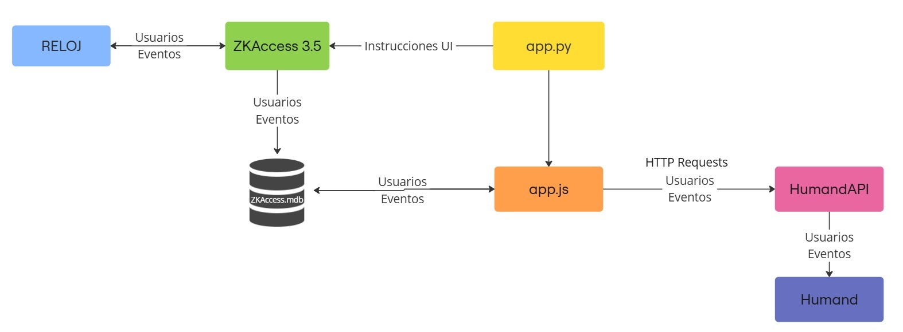

# Esquematización del flujo de datos

1. Se cargan usuarios y fichadas en los relojes
2. app.py abre e interactúa con ZKAcces 3.5, descarga eventos (fichadas)
3. Los eventos se registran en la base de datos
4. Se ejecuta app.js
   - Levanta los datos de la bbdd ZKAccess.mdb
   - Si se encuentra nuevos usuarios se suman a un .csv y se suben a Humand
   - Se filtran los registros de las fichadas:
     - **Se discrimina entre entrada y salida.**
     - Se almacenan en .csv diario y luego se sube a Humand

## Consideraciones

El sistema es implementable, pero hay cuestiones a tener en cuenta, para registrar fichadas la API de Humand tiene dos endpoints: 

/time-tracking/entires/clockIn 
/time-tracking/entires/clockOut 

¿Qué implica esto? La discriminación entre entrada y salida se debe hacer desde nuestro sistema de integración.  Posibilidad de fichada <strong>diaria</strong>:

<table >
    <thead>
        <tr>
            <th>#</th>
            <th>Entrada</th>
            <th>Salida</th>
            <th>Resultado</th>
        </tr>
    </thead>
    <tbody>
        <tr>
            <td>1</td>
            <td>Reloj</td>
            <td>Reloj</td>
            <td>OK</td>
        </tr>
        <tr>
            <td>2</td>
            <td>Reloj</td>
            <td>App</td>
            <td>OK</td>
        </tr>
        <tr>
            <td>3</td>
            <td>App</td>
            <td>App</td>
            <td>OK</td>
        </tr>
        <tr>
            <td>4</td>
            <td>App</td>
            <td>Reloj</td>
            <td><strong style="color: red;">ERROR</strong></td>
        </tr>
    </tbody>
</table>

En el caso 4 el ERROR se generaría porque la app registraría la entrada (sin que el sistema se entere) y luego el reloj registraría un evento que, al ser el primero y único para el usuario, lo detectará como una entrada y la volverá a cargar. Según lo hablado con Humand, en este caso al volver a enviarle una entrada, no se registraría y quedaría solo la primera (realizada por la app)

Este error tabién se genera si el usuario se olvida de fichar la entrada y ficha la salida en el reloj 

## Posibles soluciones
<ol>
    <li>
        Cambiar el procesamiento de entrada y salida. En vez de hacerlo automático se haría al momento de fichar. Para esto se necesita 
        <ol type="a">
            <li>Cambiar la configuración actual de todos los relojes</li>
            <li>Enseñarle a los usuarios a que elijan si es entrada o salida</li>
        </ol>
        De todas maneras, si bien se puede aplicar <strong>amplía la posibilidad de un error humano</strong>. Principalmente en la oficina y planta MDP, ya que los relojes son más viejos y es ligeramente más complicada la selección de entrada/salida.
    </li>
    <li>
        Respetar las maneras de fichar: 1, 2, 3 según tabla
    </li>
    <li>
        No implementar sistema mixto 
    </li>
</ol>

